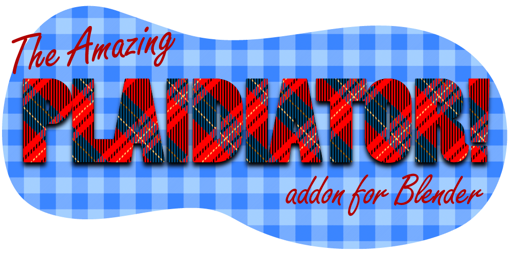
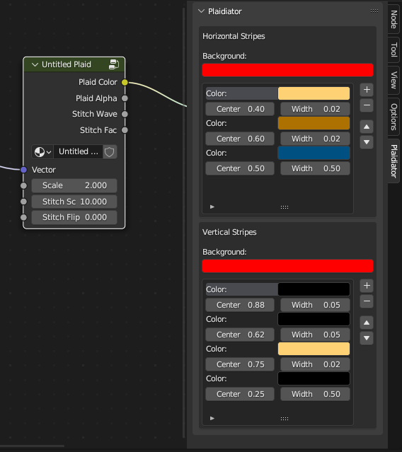

# Plaidiator

https://github.com/SuperFLEB/blender_plaidiator

The Plaidiator addon introduces the Plaidiator Plaid nodegroup to the Shader Editor, which allows
you to easily create and edit plaid patterns. After installing and activating the addon, you'll
now see "Plaidiator Plaid" as something you can Add in the shader editor (in the Shift-A "Add" menu),
and there will be a new N-Panel in the Shader Editor to edit these plaid patterns.

## To install

Either install the ZIP file from the release, clone this repository and use the
build_release.py script to build a ZIP file that you can install into Blender.

Once installed, you can set the location of the Plaidiator N-panel to either a Plaidiator tab, or under
the Node tab, using the Preferences panel for the addon.

## To use

Once the addon is installed and activated...

1. Create a material and edit it in the Shader Editor.
2. In the Shader Editor, open the Add menu (Shift+A) and add a new "Plaidiator Plaid"
3. A nodegroup named "Untitled Plaid" appears. Attach the "Plaid Color" to the color input on a shader,
   or just to the "Surface" output if you're having a quick look.
4. Add or connect a Texture Coordinate, UV Map, or other vector input to the Vector socket. The material
   should now show a plaid texture.
5. Open the N-Panel in the Shader Editor (N), and go to the Plaidiator tab.
6. Select the Plaidiator Plaid node you want to edit.
7. When you select the node, the Plaidiator panel should show the plaid pattern editor for the node.
   In this panel, you can add, remove, arrange, and modify the stripes in the plaid pattern. Each stripe
   has a color, a center position, and a width. Stripes are painted from the bottom up, so stripes higher
   in the list will cover stripes lower in the list. Get creative!

## The Details

This addon works by cloning a Plaidiator Plaid nodegroup, that creates a plaid pattern using horizontal and
vertical stripes made with Color Ramp nodes. The nodegroup can be edited using the Plaidiator N-Panel, that
works in stripes instead of color stops, allowing for simpler non-destructive plaid pattern creation.

### Input Sockets

* **Vector**: A texture space for the plaid pattern. Attach this to a UV Map, Texture Coordinates, etc.
* **Scale**: The overall scale of the plaid pattern.
* **Stitch Scale**: The scale of the diagonal hatching that combines horizontal and vertical stripes.
* **Stitch Flip**: The rotation of the diagonal hatching. 0.0 is the default SW-to-NE, 1.0 flips it to NW-SE.

### Output Sockets

* **Plaid Color**: The color of the plaid pattern
* **Plaid Alpha**: The alpha of the plaid pattern
* **Stitch Wave**: A smooth (sine) wave matching the stitching, useful for bump mapping, etc.
* **Stitch Fac**: A hard (0 or 1) stripe pattern matching the stitching exactly

### Inside the Node Group

The addon makes a new nodegroup each time you add a Plaidiator Plaid. Inside this nodegroup is what makes the
Plaidiator tick. It's driven primarily by the two Color Ramp nodes, which you should **not** delete or modify
directly. Modifications will be cleared whenever the Plaidiator N-Panel is used, and deleting the nodes may cause
the Plaid not to be editable by the Plaidiator addon any more. Use the Plaidiator N-panel to modify the pattern.

*(And, yes, the plaid patterns used in the header image above were made using Plaidiator.)*